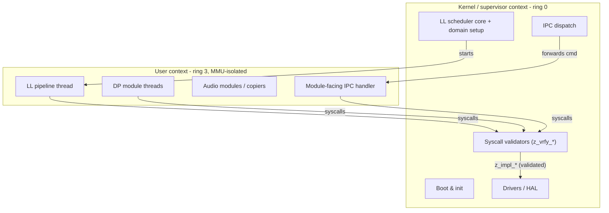
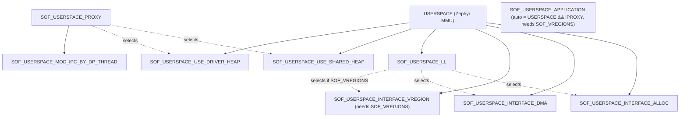

# SOF User/Kernel Split — Architecture and Conventions

This is the canonical reference for how Sound Open Firmware (SOF) is divided between
**kernel (supervisor) context** and **user (unprivileged) context** on top of Zephyr
userspace. It defines the conventions that make the split evident in the source layout and
easy to maintain.

> **Status:** convention proposal. The execution model and the syscall/marker/Kconfig facts
> below reflect the code as it is today. The *directory taxonomy* and the per-directory
> "Runs in:" banners are the proposed mechanism for making the split visible; they are being
> rolled out incrementally.

## Why this exists

On PTL (`intel_adsp_ace30_ptl`) builds, audio application logic runs in Zephyr **user-space**
by default. The board config enables `CONFIG_USERSPACE`, and
`app/overlays/ptl/ll_userspace_overlay.conf` enables `CONFIG_SOF_USERSPACE_LL`, so the
low-latency (LL) pipeline, the data-processing (DP) modules, and the module-facing IPC all
execute in MMU-protected user threads. The kernel keeps the OS/HAL, boot, drivers, and the
syscall validators.

The privilege boundary is real, but nothing in the source *layout* signals which side a given
file belongs to. This document makes that explicit.

## Execution model



- **Kernel context** owns hardware, boot, interrupt handling, memory-domain construction, and
  the *validating* half of every syscall (`z_vrfy_*`).
- **User context** runs the audio application: LL pipeline processing, DP modules, copiers,
  and the module-facing IPC path. It touches kernel resources **only** through syscalls.
- The **only sanctioned crossings** between the two are Zephyr syscalls (see
  [The boundary is the syscall set](#the-boundary-is-the-syscall-set)).

## Directory taxonomy — where code runs

Every `src/` subdirectory falls into one of four tiers. This is the primary mechanism for
making the split evident: the tier tells you where a directory's code runs before you read a
line of it. Each top-level directory's own `README.md` repeats its tier in a **"Runs in:"**
banner.

| Tier | Meaning | Directories |
|------|---------|-------------|
| **Kernel-only** | OS integration, HAL, boot, inter-core. Never executes in a user thread. Must not be reached directly from user code — only via a syscall. | `arch/`, `drivers/`, `idc/`, `init/`, `platform/`, `probe/`, `logging/`, `trace/` |
| **Boundary / bridge** | Owns the syscalls and the thread / memory-domain setup. Split internally: some translation units run kernel-side, some user-side (e.g. `handler-kernel.c` vs `handler-user.c`, `zephyr_ll.c` vs `zephyr_ll_user.c`). | `schedule/`, `ipc/`, `library_manager/`, `debug/debug_stream/`, and (in the Zephyr integration tree) `zephyr/syscall/` |
| **Application** | Audio pipeline / component logic that runs in user threads under userspace configs. | `audio/` |
| **Shared library** | Context-agnostic code linked into whichever context calls it. Must stay "user-safe": no privileged operations (no direct MMIO, no spinlocks held across syscalls, no raw kernel object access) so it is safe when pulled into a user build. | `lib/`, `math/`, `module/` |

Classification is grep-verifiable — see [Verifying the taxonomy](#verifying-the-taxonomy).

> **`zephyr/syscall/` is the model to grow toward.** The Zephyr integration tree already
> collects the validating half of several syscalls in one place — `zephyr/syscall/alloc.c`,
> `cpu.c`, `vregion.c`, `dai.c`, `sof_dma.c` each hold the `z_vrfy_*` wrappers for their
> subsystem, physically separated from the `z_impl_*` logic (in `zephyr/lib/*.c` and
> `src/lib/*.c`). This is exactly the boundary-tier separation this document promotes; the
> migration opportunity is to move the *still-scattered* validators (IPC, module management,
> library manager, scheduling, debug) toward the same convention.

> Borderline cases (e.g. parts of `lib/` that host syscall *implementations* such as `dma.c`
> and `dai.c`) behave as boundary code even though the directory is mostly shared-library. When
> a single directory genuinely mixes tiers, its README states the exception explicitly.

## The boundary is the syscall set

Zephyr crosses the user/kernel boundary with system calls declared `__syscall` in a header and
implemented as two functions:

- `z_vrfy_<name>()` — **kernel-side validator**. Runs in supervisor mode, validates every
  argument coming from user space (`K_SYSCALL_MEMORY_READ/WRITE`, `K_SYSCALL_OBJ`,
  `k_usermode_from/to_copy`), then calls the implementation. This is the trust boundary.
- `z_impl_<name>()` — the actual logic. Callable directly from kernel code (fast path) or from
  the validator when the call originates in user space.

**These pairs are the entire user/kernel API surface.** The full, authoritative map lives in
[`syscalls.h`](syscalls.h) in this directory. Summary by subsystem:

| Subsystem | Syscalls | Declared in | Validator (`z_vrfy_`) / logic (`z_impl_`) |
|-----------|----------|-------------|-------------------------------------------|
| IPC | `ipc_msg_send`, `ipc_msg_list_remove`, `ipc_msg_reply`, `ipc_compound_pre_start`, `ipc_compound_post_start`, `ipc_wait_for_compound_msg`, `send_resource_notif` | `sof/ipc/msg.h`, `sof/ipc/ipc_reply.h`, `ipc4/handler.h`, `ipc4/notification.h` | scattered: `ipc/ipc-common.c`, `ipc/ipc3/helper.c`, `ipc/ipc4/handler-kernel.c`, `ipc/ipc4/notification.c` |
| Heap alloc | `sof_heap_alloc`, `sof_heap_free` | `rtos/alloc.h` | `zephyr/syscall/alloc.c` / `zephyr/lib/alloc.c` |
| Virtual regions | `vregion_create_map`, `vregion_set_interim`, `vregion_get`, `vregion_put`, `vregion_alloc_align`, `vregion_alloc_coherent_align`, `vregion_free` | `sof/lib/vregion.h` | `zephyr/syscall/vregion.c` / `zephyr/lib/vregion.c` |
| DMA | `sof_dma_get`, `sof_dma_put`, `sof_dma_get_attribute`, `sof_dma_request_channel`, `sof_dma_release_channel`, `sof_dma_config`, `sof_dma_start`, `sof_dma_stop`, `sof_dma_get_status`, `sof_dma_reload`, `sof_dma_suspend`, `sof_dma_resume` | `sof/lib/sof_dma.h` | `zephyr/syscall/sof_dma.c` / `lib/dma.c` |
| DAI | `dai_get_device` | `sof/lib/dai-zephyr.h` | `zephyr/syscall/dai.c` / `lib/dai.c` |
| CPU | `cpu_get_id` | `sof/lib/cpu.h` | `zephyr/syscall/cpu.c` / `zephyr/lib/cpu.c` |
| Module management | `mod_balloc_align`, `mod_alloc_ext`, `mod_free`, `mod_free_all`, `mod_data_blob_handler_new`, `mod_fast_get` | `sof/audio/module_adapter/module/generic.h` | scattered: `audio/module_adapter/module/generic.c` |
| Library manager | `lib_manager_free_module` | `sof/lib_manager.h` | scattered: `library_manager/lib_manager.c` |
| Scheduling | `zephyr_ll_task_sem_alloc`, `zephyr_ll_task_sem_free`, `scheduler_dp_internal_free`, `scheduler_dp_ll_tick` | `sof/schedule/ll_schedule_domain.h`, `sof/schedule/dp_schedule.h` | scattered: `schedule/zephyr_ll.c`, `schedule/zephyr_dp_schedule*.c` |
| Debug | `debug_stream_slot_send_record` | `user/debug_stream_slot.h` | scattered: `debug/debug_stream/debug_stream_slot.c` |

The `zephyr/syscall/*.c` files hold the validators in one place per subsystem; the rows marked
**scattered** keep their `z_vrfy_` next to the kernel logic and are the migration targets.

Most syscall declarations are gated by `#if defined(__ZEPHYR__) && defined(CONFIG_SOF_FULL_ZEPHYR_APPLICATION)`; outside that, the same name is a plain inline that calls `z_impl_*` directly (the non-userspace / host-test build).

## Memory-partition markers

User threads can only touch memory that is mapped into their memory domain. SOF exposes shared
globals to user threads through Zephyr application memory partitions. The markers live in
[`rtos/userspace_helper.h`](../../../../zephyr/include/rtos/userspace_helper.h):

| Marker | Partition | Availability | Use for |
|--------|-----------|--------------|---------|
| `APP_TASK_DATA` / `APP_TASK_BSS` | `common_partition` | `CONFIG_USERSPACE` | Data shared with all user-space modules/tasks |
| `APP_SYSUSER_DATA` / `APP_SYSUSER_BSS` | `sysuser_partition` | `CONFIG_SOF_USERSPACE_LL` | Data shared with the system LL user thread |
| `K_APP_DMEM(part)` / `K_APP_BMEM(part)` | caller-defined | `CONFIG_USERSPACE` | A component's own partition (e.g. `ipc_context_part`) |

When userspace is disabled, all four SOF markers expand to nothing, so annotated globals are
ordinary variables in non-userspace builds.

**Rule:** *any global that a user thread reads or writes must carry a partition marker at its
declaration site.* Conversely, marked data is **user-writable**, so kernel code must never
trust it — re-validate on every use. See the warning in
[`schedule/zephyr_ll_user.c`](../../../schedule/zephyr_ll_user.c) around `zephyr_ll_heap`, and
`zephyr_ll_user_heap_verify()` which exists precisely because the user-visible heap pointer
cannot be trusted.

## Kconfig hierarchy

The userspace behaviour is assembled from a small option tree (source of truth:
[`zephyr/Kconfig`](../../../../zephyr/Kconfig)).



Key options:

- **`SOF_USERSPACE_LL`** — run LL pipelines in user threads (`depends on USERSPACE`; selects
  the ALLOC/DMA/VREGION interfaces). This is what the PTL overlay turns on.
- **`SOF_USERSPACE_PROXY`** — run modules inside a proxy container that forwards kernel-side
  calls to user-privileged module code (selects the driver + shared heaps).
- **`SOF_USERSPACE_APPLICATION`** — not user-settable; a shortcut for
  `USERSPACE && !SOF_USERSPACE_PROXY` (`depends on SOF_VREGIONS`), used to switch the DP
  scheduler between the `_application` and `_thread` implementations in
  [`schedule/CMakeLists.txt`](../../../schedule/CMakeLists.txt).
- **`SOF_USERSPACE`** — a separate WIP flag for userspace *modules*; do not confuse with
  `USERSPACE` (the Zephyr option) or `SOF_USERSPACE_LL`.

## Rules for placing new code

1. **Pick the tier first.** OS/HAL/boot → a kernel-only directory. Audio application logic →
   `audio/`. Reusable pure code → a shared-library directory (keep it user-safe).
2. **Cross the boundary only via a syscall.** Add a `__syscall` declaration, put the
   `z_vrfy_` validator in the boundary tier — preferably in `zephyr/syscall/<subsystem>.c`
   alongside the existing ones — validate every argument, and list the new call in
   [`syscalls.h`](syscalls.h).
3. **Mark shared globals.** Any global a user thread reads/writes gets `APP_TASK_*`,
   `APP_SYSUSER_*`, or a `K_APP_*` partition marker — and the kernel re-validates it.
4. **Grant kernel objects explicitly.** User threads need `k_object_access_grant()` /
   `k_thread_access_grant()` for each kernel object they use.
5. **Split by suffix inside boundary directories.** Where a subsystem has both sides, keep the
   existing `-kernel` / `-user` file split so the two contexts stay physically separate.

## Verifying the taxonomy

The tier of any directory can be confirmed from its source signals:

```sh
# Boundary code: declares or implements syscalls
grep -rl 'z_vrfy_\|__syscall' src/<dir>

# User-visible data: partition markers
grep -rl 'APP_SYSUSER\|APP_TASK\|K_APP_BMEM\|K_APP_DMEM\|K_APPMEM_PARTITION' src/<dir>

# User threads / object grants / domains
grep -rl 'K_USER\|_access_grant\|mem_domain' src/<dir>
```

A kernel-only directory returns nothing for all three. A boundary directory hits the first (and
usually the third). The application/shared tiers hit markers but should not host `z_vrfy_`
validators.

## Related files

- [`syscalls.h`](syscalls.h) — the authoritative syscall map.
- [`zephyr/include/rtos/userspace_helper.h`](../../../../zephyr/include/rtos/userspace_helper.h)
  — partition markers and user-space helper API.
- [`schedule/README.md`](../../../schedule/README.md),
  [`ipc/README.md`](../../../ipc/README.md),
  [`audio/module_adapter/README.md`](../../../audio/module_adapter/README.md) — boundary
  subsystems.
- [`AGENTS.md`](../../../../AGENTS.md) — contributor rules that reference this document.
