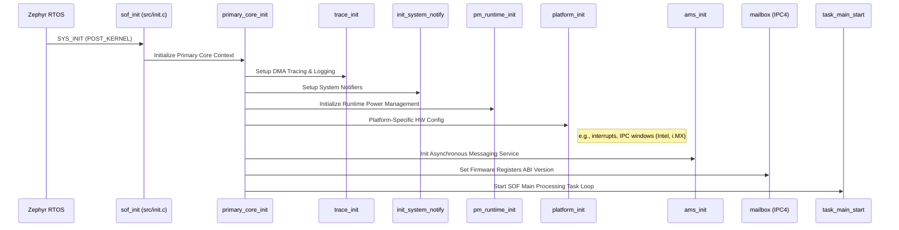
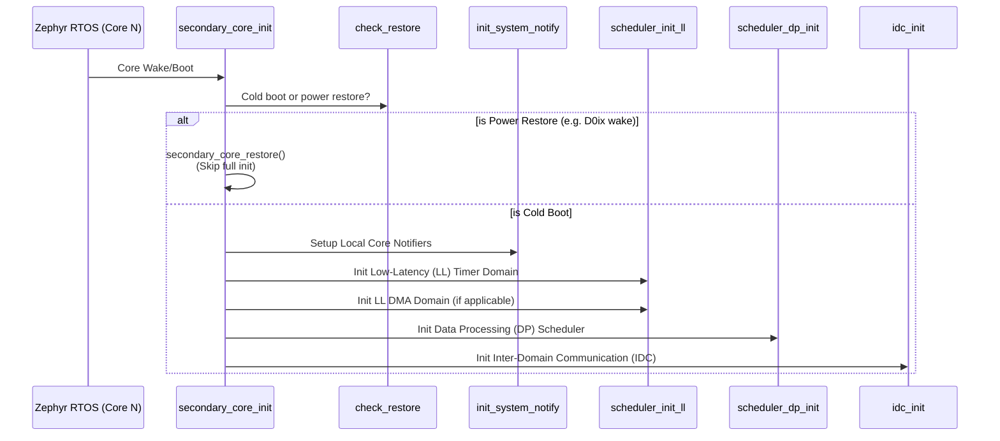
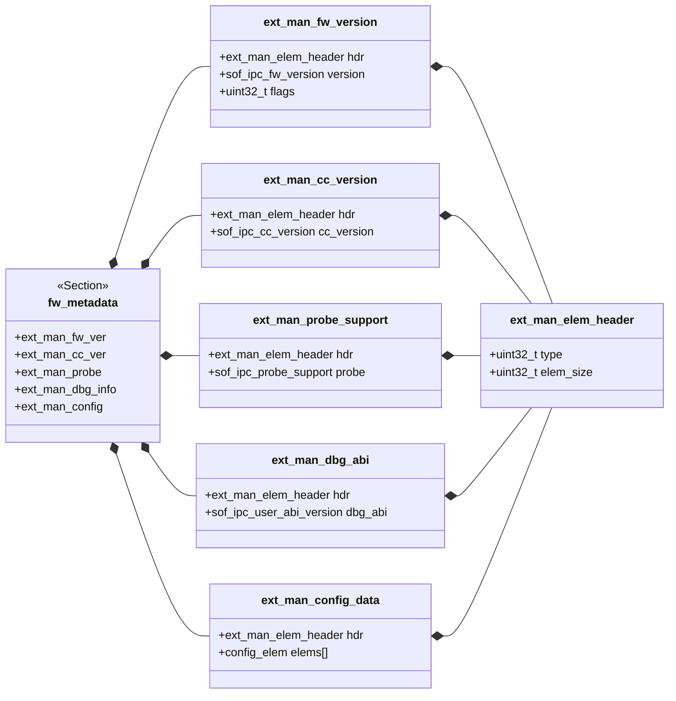

# DSP Initialization (`src/init`)

The `src/init` directory contains the generic digital signal processor (DSP) initialization code and firmware metadata structures for Sound Open Firmware (SOF). It acts as the bridge between the underlying RTOS (Zephyr) boot phase and the SOF-specific task scheduling and processing pipelines.

## Architecture and Boot Flow

The firmware initialization architecture relies on the Zephyr RTOS boot sequence. Zephyr handles the very early hardware setup and kernel initialization before invoking SOF-specific routines via Zephyr's `SYS_INIT` macros.

### Primary Core Boot Sequence

The primary entry point for SOF system initialization is `sof_init()`, registered to run at Zephyr's `POST_KERNEL` initialization level. This ensures basic OS primitives (like memory allocators and threads) are available before SOF starts.

`sof_init()` delegates to `primary_core_init()`, which executes the following sequence:

1. **Context Initialization**: Sets up the global `struct sof` context.
2. **Logging and Tracing**: Initializes Zephyr's logging timestamps and SOF's DMA trace infrastructure (`trace_init()`), printing the firmware version and ABI banner.
3. **System Subsystems**:
   - Initializes the system notifier (`init_system_notify()`) for inter-component messaging.
   - Sets up runtime power management (`pm_runtime_init()`).
4. **Platform-Specific Initialization**: Calls `platform_init()` to allow the specific hardware platform (e.g., Intel cAVS, i.MX) to configure its hardware IPs, interrupts, and IPC mailbox memory windows.
5. **Architectural Handoff**: For IPC4, it sets the Firmware Registers ABI version in the mailbox. It may also unpack boot manifests if configured.
6. **Task Scheduler**: Finally, it calls `task_main_start()` to kick off the main SOF processing task loop.

### Secondary Core Boot Sequence

For multi-core DSP platforms, secondary cores execute `secondary_core_init()`:

1. **Power State Checking**: It checks if the core is cold booting or resuming from a low-power retention/restore state (e.g., D0ix) via `check_restore()`. In the restore case, it restores state without re-allocating core structures; in the cold-boot case, it follows the full initialization path described below.
2. **Local Subsystem Setup**: Sets up system notifiers for the local core.
3. **Scheduler Setup**: Initializes the Low-Latency (LL) and Data Processing (DP) schedulers on the secondary core.
4. **Inter-Core Communication**: Initializes the Inter-Domain Communication (IDC) mechanism (`idc_init()`), allowing cross-core messaging.

### Firmware Extended Manifest (`ext_manifest.c`)

This directory also provides the extended manifest implementation. The manifest consists of structured metadata embedded into the `.fw_metadata` section of the firmware binary.

When the host OS (e.g., Linux SOF driver) parses the firmware binary before loading it, it reads these manifest structures to discover firmware capabilities dynamically. The manifest includes:

- **Firmware Version**: Major, minor, micro, tag, and build hashes (`ext_man_fw_ver`).
- **Compiler Version**: Details of the toolchain used to compile the firmware (`ext_man_cc_ver`).
- **Probe Info**: Extraction probe configurations and limits (`ext_man_probe`).
- **Debug ABI**: Supported debugger ABI versions (`ext_man_dbg_info`).
- **Configuration Dictionary**: Compile-time enabled features and sizing parameters (e.g., `SOF_IPC_MSG_MAX_SIZE`).
