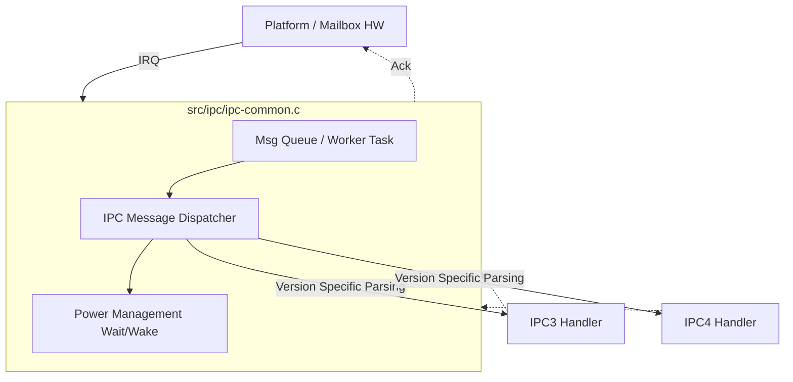
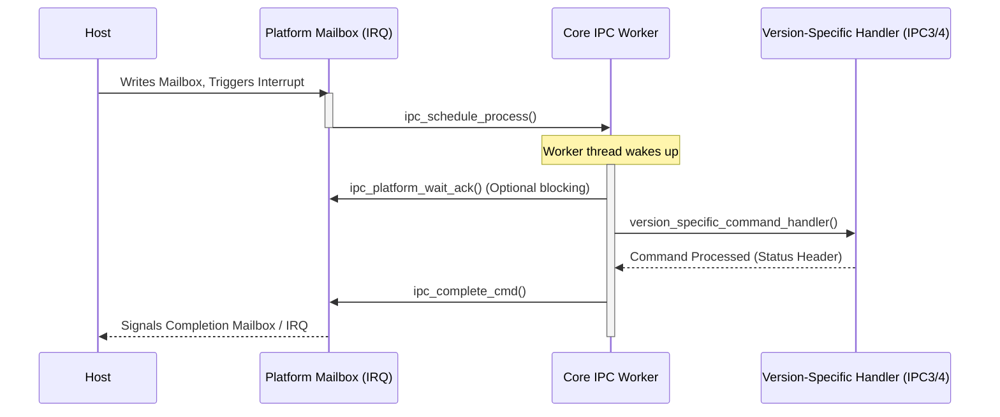
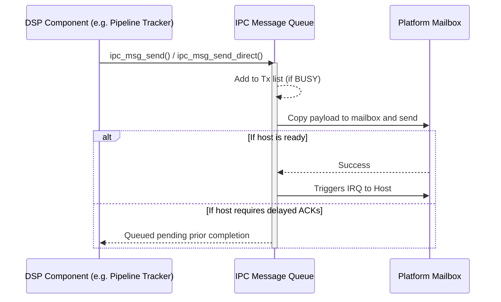

# Inter-Processor Communication (IPC) Core Architecture

This directory contains the common foundation for all Inter-Processor Communication (IPC) within the Sound Open Firmware (SOF) project. It bridges the gap between hardware mailbox interrupts and the version-specific (IPC3/IPC4) message handlers.

## Overview

The Core IPC layer is completely agnostic to the specific structure or content of the messages (whether they are IPC3 stream commands or IPC4 pipeline messages). Its primary responsibilities are:

1. **Message State Management**: Tracking if a message is being processed, queued, or completed.
2. **Interrupt Bridging**: Routing incoming platform interrupts into the Zephyr or SOF thread-domain scheduler.
3. **Queueing**: Safe traversal and delayed processing capabilities via `k_work` items or SOF scheduler tasks.
4. **Platform Acknowledgment**: Signaling the hardware mailbox layers to confirm receipt or signal completion out entirely.

## Architecture Diagram

The basic routing of any IPC message moves from a hardware interrupt, through the platform driver, into the core IPC handlers, and ultimately up to version-specific handlers.

## Processing Flow

When the host writes a command to the IPC mailbox and triggers an interrupt, the hardware-specific driver (`src/platform/...`) catches the IRQ and eventually calls down into the IPC framework.

Different RTOS environments (Zephyr vs. bare metal SOF native) handle the thread handoff differently. In Zephyr, this leverages the `k_work` queues heavily for `ipc_work_handler`.

### Receiving Messages (Host -> DSP)

### Sending Messages (DSP -> Host)

Firmware-initiated messages (like notifications for position updates, traces, or XRUNs) rely on a queue if the hardware is busy.

## Global IPC Objects and Helpers

* `ipc_comp_dev`: Wrapper structure linking generic devices (`comp_dev`) specifically to their IPC pipeline and endpoint identifiers.
* `ipc_get_comp_dev` / `ipc_get_ppl_comp`: Lookup assistants utilizing the central graph tracking to find specific components either directly by component ID or by traversing the pipeline graph starting from a given `pipeline_id` and direction (upstream/downstream).
