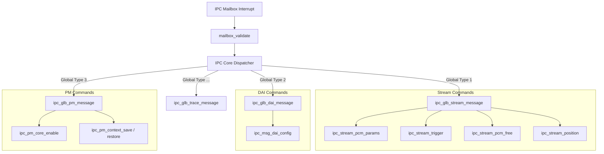
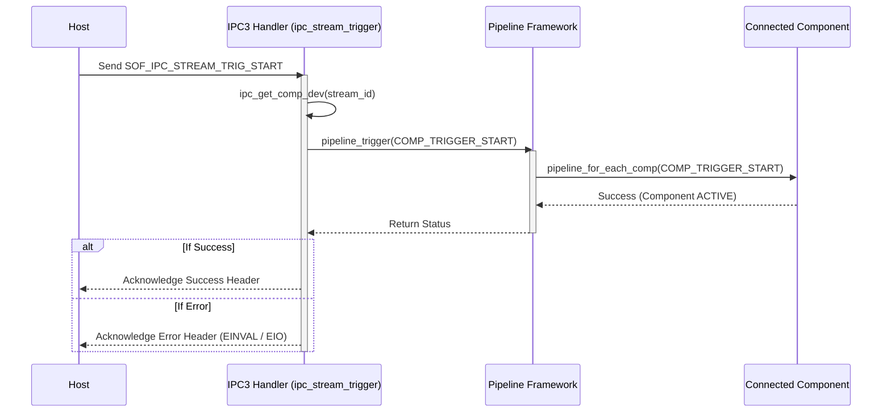
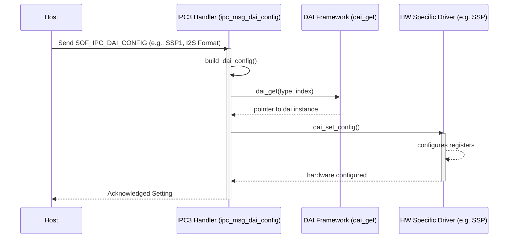

# IPC3 Architecture

This directory houses the Version 3 Inter-Processor Communication handling components. IPC3 is the older, legacy framework structure used extensively across initial Sound Open Firmware releases before the transition to IPC4 compound pipeline commands.

## Overview

The IPC3 architecture treats streaming, DAI configurations, and pipeline management as distinct scalar events. Messages arrive containing a specific `sof_ipc_cmd_hdr` denoting the "Global Message Type" (e.g., Stream, DAI, Trace, PM) and the targeted command within that type.

## Command Structure and Routing

Every message received is placed into an Rx buffer and initially routed to `ipc_cmd()`. Based on the `cmd` inside the `sof_ipc_cmd_hdr`, it delegates to one of the handler subsystems:

* `ipc_glb_stream_message`: Stream/Pipeline configuration and states
* `ipc_glb_dai_message`: DAI parameters and formats
* `ipc_glb_pm_message`: Power Management operations

## Processing Flows

### Stream Triggering (`ipc_stream_trigger`)

Triggering is strictly hierarchical via IPC3. It expects pipelines built and components fully parsed prior to active streaming commands.

1. **Validation**: The IPC fetches the host component ID.
2. **Device Lookup**: It searches the components list (`ipc_get_comp_dev`) for the PCM device matching the pipeline.
3. **Execution**: If valid, the pipeline graph is crawled recursively and its state altered via `pipeline_trigger`.

### DAI Configuration (`ipc_msg_dai_config`)

DAI (Digital Audio Interface) configuration involves setting up physical I2S, ALH, SSP, or HDA parameters.

1. **Format Unpacking**: Converts the `sof_ipc_dai_config` payload sent from the ALSA driver into an internal DSP structure `ipc_config_dai`.
2. **Device Selection**: Identifies the exact DAI interface and finds its tracking device ID via `dai_get`.
3. **Hardware Config**: Applies the unpacked settings directly to the hardware via the specific DAI driver's `set_config` function.

## Mailbox and Validation (`mailbox_validate`)

All commands passing through this layer enforce rigid payload boundaries. `mailbox_validate()` reads the first word directly from the mailbox memory, identifying the command type before parsing parameters out of shared RAM to prevent host/DSP mismatches from cascading.
