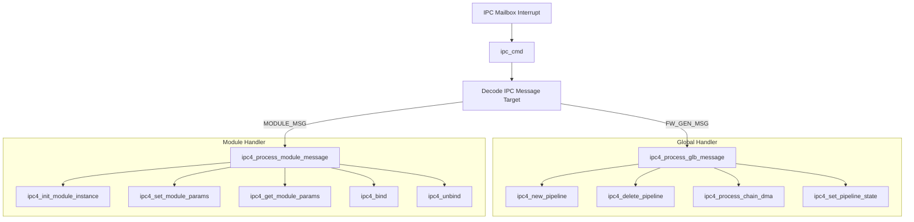
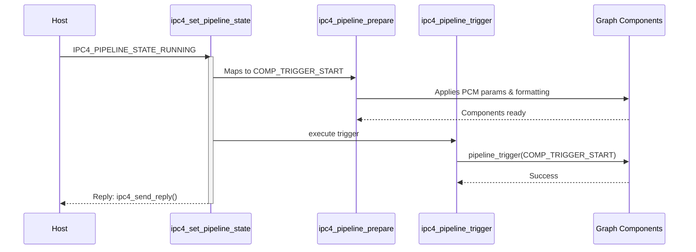
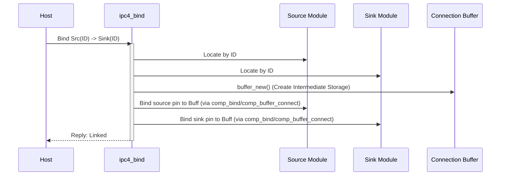

# IPC4 Architecture

This directory holds the handlers and topology parsing logic for Inter-Processor Communication Version 4. IPC4 introduces a significantly denser, compound-command structure heavily based around the concept of "pipelines" and dynamic "modules" rather than static DSP stream roles.

## Overview

Unlike older iterations (IPC3) which trigger single components via scalar commands, IPC4 uses compound structures. A single host interrupt might contain batch operations like building an entire processing chain, setting module parameters sequentially, and triggering a start across multiple interconnected blocks simultaneously.

## Message Handling and Dispatch

IPC4 messages are received via the generic IPC handler entry point `ipc_cmd()`. `ipc_cmd()` determines the IPC target and dispatches the message appropriately. Global messages are dispatched to `ipc4_process_glb_message()`, while module-specific messages are routed directly to `ipc4_process_module_message()`.

## Processing Flows

### Pipeline State Management (`ipc4_set_pipeline_state`)

The core driver of graph execution in IPC4 is `ipc4_set_pipeline_state()`. This accepts a multi-stage request (e.g., `START`, `PAUSE`, `RESET`) and coordinates triggering the internal pipelines.

1. **State Translation**: It maps the incoming IPC4 state request to an internal SOF state (e.g., `IPC4_PIPELINE_STATE_RUNNING` -> `COMP_TRIGGER_START`).
2. **Graph Traversal**: It fetches the pipeline object associated with the command and begins preparing it (`ipc4_pipeline_prepare`).
3. **Trigger Execution**: It executes `ipc4_pipeline_trigger()`, recursively changing states across the internal graphs and alerting either the LL scheduler or DP threads.

### Module Instantiation and Binding (`ipc4_bind`)

In IPC4, modules (components) are bound together dynamically rather than constructed statically by the firmware at boot time.

1. **Instantiation**: `ipc4_init_module_instance()` allocates the module via the DSP heap arrays based on UUIDs.
2. **Binding**: `ipc4_bind()` takes two module IDs and dynamically connects their sink and source pins using intermediate `comp_buffer` objects.

## Compound Messages (`ipc_wait_for_compound_msg`)

To accelerate initialization, IPC4 enables Compound commands. A host can send multiple IPC messages chained back-to-back using a single mailbox trigger flag before waiting for ACKs.

`ipc_compound_pre_start` and `ipc_compound_post_start` manage this batch execution safely without overflowing the Zephyr work queues or breaking hardware configurations during intermediate states.
