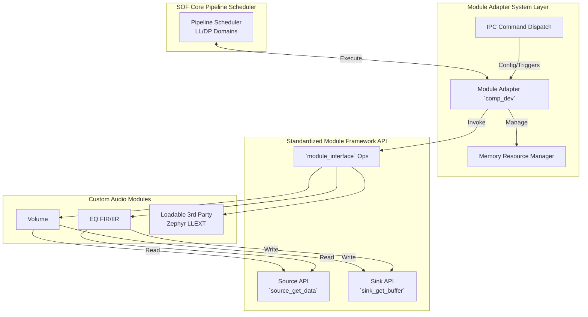
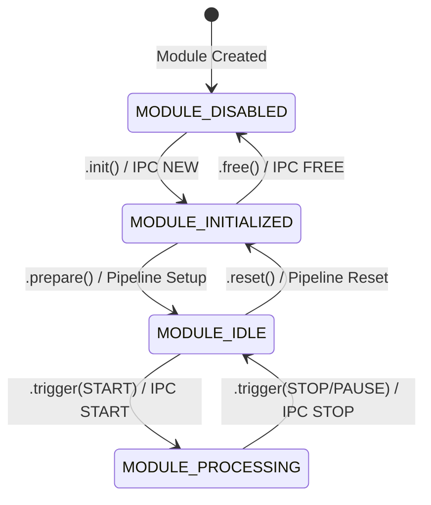
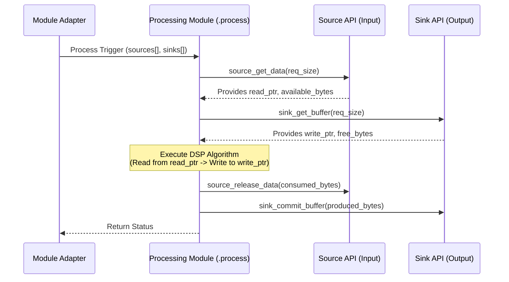

# Audio Processing Modules (`src/module`)

The `src/module` directory and the `src/include/module` headers define the Sound Open Firmware (SOF) modern Audio Processing Module API. This architecture abstracts the underlying OS and pipeline scheduler implementations from the actual audio signal processing logic, allowing modules to be written once and deployed either as statically linked core components or as dynamically loadable Zephyr EXT (LLEXT) modules.

## Architecture Overview

The SOF module architecture is built around three core concepts:

1. **`struct module_interface`**: A standardized set of operations (`init`, `prepare`, `process`, `reset`, `free`, `set_configuration`) that every audio processing module implements.
2. **`struct processing_module`**: The runtime instantiated state of a module. It holds metadata, configuration objects, memory allocations (`module_resources`), and references to interconnected streams.
3. **Module Adapter (`src/audio/module_adapter`)**: The system glue layer. It masquerades as a legacy pipeline `comp_dev` to the SOF schedulers, but acts as a sandbox container for the `processing_module`. It intercepts IPC commands, manages the module's state machine, manages inputs/outputs, and safely calls the `module_interface` operations.

## Module State Machine

Every processing module is strictly governed by a uniform runtime state machine managed by the `module_adapter`. Modules must adhere to the transitions defined by `enum module_state`:

1. `MODULE_DISABLED`: The module is loaded but uninitialized, or has been freed. No memory is allocated.
2. `MODULE_INITIALIZED`: After a successful `.init()` call. The module parses its IPC configuration and allocates necessary local resources (delay lines, coefficient tables).
3. `MODULE_IDLE`: After a successful `.prepare()` call. Audio stream formats are fully negotiated and agreed upon (Stream params, channels, rate).
4. `MODULE_PROCESSING`: When the pipeline triggers a `START` command. The `.process()` callback is actively handling buffers.

## Data Flows and Buffer Management

Modules do not directly manipulate underlying DMA, ALSA, or Zephyr `comp_buffer` pointers. Instead, they interact via the decoupled **Source and Sink APIs**. This allows the adapter to seamlessly feed data from varying topological sources without changing module code.

The flow operates primarily in a "get -> manipulate -> commit/release" pattern:

### Source API (`src/module/audio/source_api.c`)
- modules request data by calling `source_get_data_s16` or `s32`. This establishes an active read lock.
- Once done, the module must call `source_release_data()` releasing only the frames actually consumed.

### Sink API (`src/module/audio/sink_api.c`)
- modules request destination buffers by calling `sink_get_buffer_s16` or `s32`.
- After processing into the provided memory array, the module marks the memory as valid by calling `sink_commit_buffer()` for the exact number of frames successfully written.
