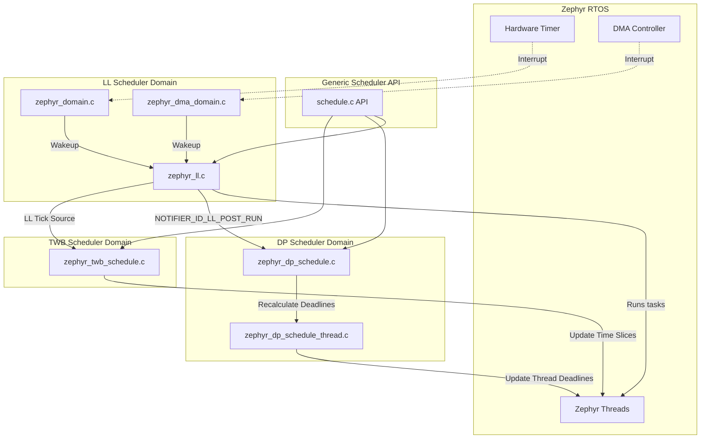
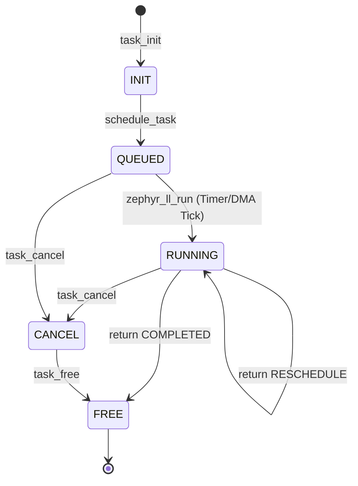
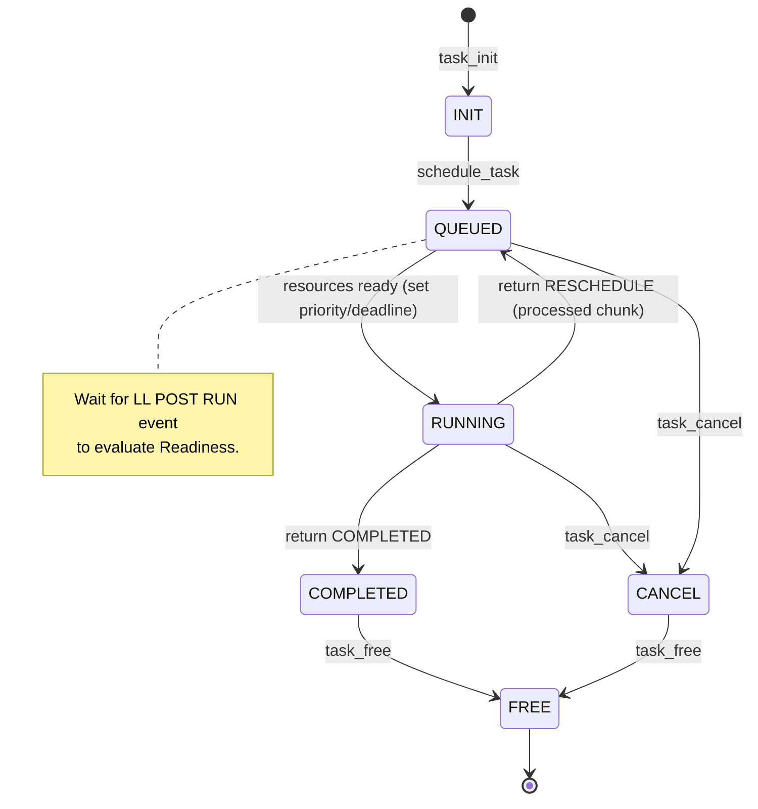
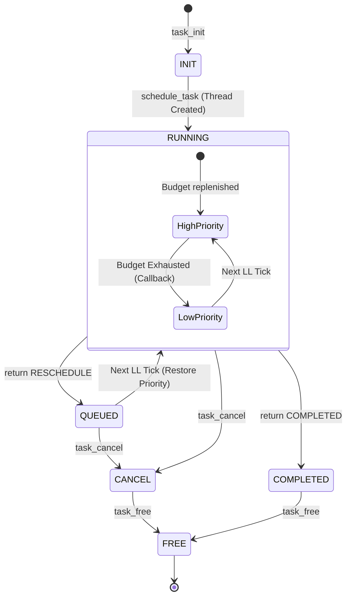

# SOF Scheduling Architecture

This directory (`src/schedule`) contains the Sound Open Firmware (SOF) scheduling infrastructure, deeply integrated with the underlying Zephyr RTOS. SOF utilizes a multi-tiered scheduling approach to cater to different real-time constraints, ranging from hard real-time, low-latency requirements to more relaxed, compute-intensive data processing tasks.

## Overview of Schedulers

SOF categorizes tasks and assigns them to specialized schedulers:

1.  **LL (Low Latency) Scheduler**: For tasks that require strict, predictable, and lowest possible latency bound to hardware events (Timers, DMA interrupts).
2.  **DP (Data Processing) Scheduler**: For compute-intensive components that process large chunks of data and operate on deadlines rather than strict cycles.
3.  **TWB (Thread With Budget) Scheduler**: For tasks that are allotted a specific execution "budget" per scheduler tick, expressed in Zephyr time-slice ticks (e.g. derived from `ZEPHYR_TWB_BUDGET_MAX` in OS ticks), which the runtime then uses to limit and account for CPU cycles to prevent starvation.

Below is a high-level component interaction architecture of the SOF scheduling domains on top of Zephyr.

---

## 1. LL (Low Latency) Scheduler

The LL scheduler (`zephyr_ll.c`) is designed for extreme low-latency processing. It bypasses complex generic Zephyr scheduling for its internal tasks to minimize overhead, executing a list of registered SOF tasks in a strict priority order.

### Architecture

-   **Domain Threads**: The LL scheduler runs within a dedicated high-priority Zephyr thread (`ll_thread0`, etc.) pinned to each core (`zephyr_domain.c`).
-   **Triggers**: It is woken up by a hardware timer (e.g., a 1ms tick) or directly by hardware DMA interrupts (`zephyr_dma_domain.c`).
-   **Execution**: Once woken up, it locks the domain, iterates through all scheduled tasks in priority order, moves them to a temporary list, and calls their `.run()` functions.
-   **Post-Run**: After all tasks execute, it triggers a `NOTIFIER_ID_LL_POST_RUN` event. This event cascades to wake up other dependent schedulers like DP and TWB. Event not run on LL userspace configuration.

### Task State Diagram

*(Note: State transitions handle Zephyr SMP locking to ensure a task is safely dequeued before state shifts)*

---

## 2. DP (Data Processing) Scheduler

The DP scheduler (`zephyr_dp_schedule.c`) manages asynchronous, compute-heavy tasks that process data when enough input is available and sufficient output space is free. It effectively relies on Zephyr's EDF (Earliest Deadline First) or standard preemptive scheduling capabilities.

### Architecture

-   **Separate Threads**: Unlike LL which multiplexes tasks inside a single thread, **each DP task is assigned its own Zephyr thread**.
-   **Wakeup Mechanism**: DP scheduling is evaluated at the end of each LL tick (`scheduler_dp_recalculate()`).
-   **Readiness**: It checks if a component has sufficient data across its sinks and sources. If so, it transitions to `RUNNING` and signals the individual DP thread via a Zephyr Event object.
-   **Deadlines**: Once ready, the DP thread computes its deadline absolute timestamp (`module_get_deadline()`) and calls `k_thread_absolute_deadline_set()`, submitting to the Zephyr kernel's EDF scheduler.

### Task State Diagram

---

## 3. TWB (Thread With Budget) Scheduler

The TWB scheduler (`zephyr_twb_schedule.c`) provides execution budget limits for specific tasks to prevent them from starving the CPU. This is useful for intensive workloads that shouldn't disrupt the overall systemic low-latency chain.

### Architecture

-   **Separate Threads**: Similar to DP, each TWB task executes in its own Zephyr thread.
-   **Time Slicing**: When scheduled, the thread's execution budget is configured in OS ticks via `k_thread_time_slice_set()`. This tick-based budget is internally converted to hardware cycles for accounting against the CPU cycles actually consumed.
-   **Budget Exhaustion**: If the thread consumes its budget (as measured in hardware cycles derived from the tick budget) before completing its work for the tick, a callback (`scheduler_twb_task_cb()`) is invoked by the Zephyr kernel. This callback immediately drops the thread's priority to a background level (`CONFIG_TWB_THREAD_LOW_PRIORITY`), preventing starvation of other threads.
-   **Replenishment**: On the next LL tick (`scheduler_twb_ll_tick()`), the consumed hardware cycles are reset, and the thread's original priority and time slice are restored, granting it a fresh tick-based budget.

### Task State Diagram

