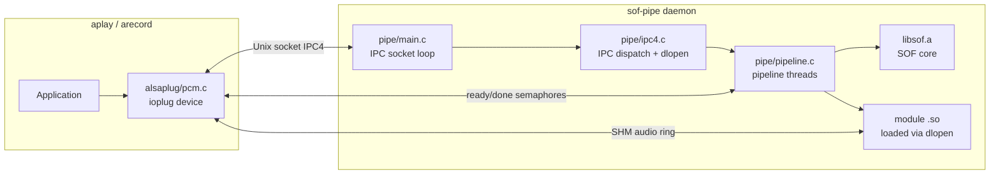
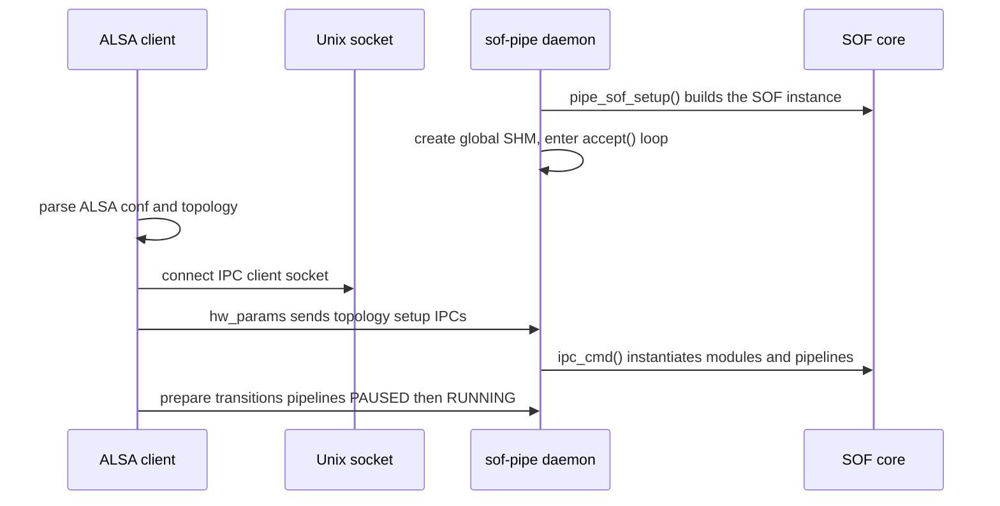
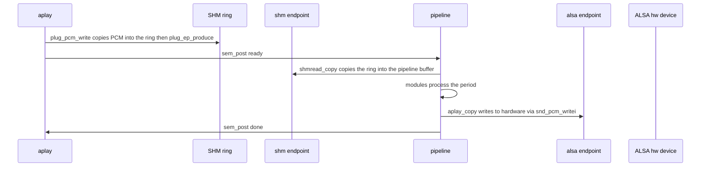

# SOF ALSA Plugin Architecture

This directory contains the SOF ALSA plugin: infrastructure that runs unmodified
SOF firmware natively on a Linux host, so topologies and processing modules can be
exercised with `aplay`/`arecord` without a physical DSP.

## Overview

The plugin is split across **two processes** that share the SOF firmware code but
play different roles:

1. **ALSA client** - the plugin loaded inside the `aplay`/`arecord` application
   (`libasound_module_pcm_sof.so`). It implements an ALSA `ioplug` device named
   `sof:...` and moves PCM data to/from the daemon.
2. **`sof-pipe` daemon** - a standalone process that links the real SOF core
   (`libsof.a`, built with `CONFIG_LIBRARY`) and actually instantiates and runs
   pipelines, components and modules.

The two processes communicate over three POSIX IPC channels:

* **Shared memory (SHM)** - an audio ring buffer per PCM, plus a global state
  block holding endpoint configuration and kcontrols.
* **Unix domain socket** - the IPC4 message transport (topology setup, pipeline
  state changes).
* **POSIX semaphores** - per-pipeline `ready`/`done` flow control.



## Component Layout

### Shared (`tools/plugin/`)

| File | Responsibility |
|------|----------------|
| `common.h` | Structures shared by both processes: `plug_shm_endpoint` (audio ring buffer), `plug_shm_glb_state` (global state, endpoint configs, kcontrols) and the ring-buffer accessor inlines. Defines the shared-memory contract. |
| `common.c` | Shared SHM, socket, semaphore and timing helpers. |

### ALSA client (`tools/plugin/alsaplug/`)

| File | Responsibility |
|------|----------------|
| `plugin.c` | Parses the ALSA configuration and command line (topology name, PCM ID, card/device/config). |
| `pcm.c` | The `snd_pcm_ioplug` implementation and PCM entry point `SND_PCM_PLUGIN_DEFINE_FUNC(sof)`. Owns `hw_params`, `prepare`, `start`, `transfer`, `pointer` and `stop`. |
| `conf.c` | ALSA configuration load hook. |
| `ctl.c` | Separate ALSA ctl (mixer/kcontrol) plugin. |
| `tplg.c` | Client-side topology parsing; emits the IPCs that instantiate widgets and pipelines. |
| `tplg_ctl.c` | kcontrol handling derived from the topology. |
| `plugin.h` | The `snd_sof_plug_t` client context type. |

### Daemon (`tools/plugin/pipe/`)

| File | Responsibility |
|------|----------------|
| `main.c` | Daemon entry point: argument parsing, SOF instance creation, global SHM setup, IPC accept loop. |
| `ipc4.c` | IPC dispatch: the `module_id` to library map, `dlopen` of modules, and the local before/after hooks around the real `ipc_cmd()`. |
| `pipeline.c` | SOF core initialisation (`pipe_sof_setup`) and the per-pipeline worker threads. |
| `cpu.c` | CPU affinity and realtime priority helpers. |
| `pipe.h` | The `sof_pipe` daemon context type. |

### Endpoints and modules (`tools/plugin/modules/`)

| File | Responsibility |
|------|----------------|
| `shm.c` | Host endpoint (`shmread`/`shmwrite`): bridges a pipeline buffer to the SHM ring buffer shared with the client. Legacy `comp_driver` component. |
| `alsa.c` | DAI endpoint (`aplay`/`arecord`): opens a real ALSA device and bridges a pipeline buffer to hardware. Legacy `comp_driver` component. |
| `ov_noise_suppression/` | An OpenVINO noise-suppression processing module using `module_interface`. Built only when OpenVINO is available. |

## ALSA Integration

The client uses the ALSA external I/O plugin mechanism (`snd_pcm_ioplug`),
registered through `SND_PCM_PLUGIN_DEFINE_FUNC(sof)`. Playback and capture install
distinct callback tables; the `transfer` callback is `plug_pcm_write` for playback
and `plug_pcm_read` for capture.

Hardware constraints advertised by `plug_hw_constraint` are deliberately wide
(formats S16/S24/S32/FLOAT, 1-8 channels, 1-192 kHz) because the effective
constraints are only known once the topology has been parsed.

## Startup Sequence

The daemon must be started before any client connects.



## IPC and Module Loading

The client translates the parsed topology into IPC4 messages sent over the socket.
The daemon handles each message in `pipe_ipc_do`, which wraps the real core handler
with local hooks:

```text
pipe_sof_ipc_cmd_before()   daemon-local actions before the core
pipe_ipc_message()          ipc_cmd() - the real SOF IPC handler
pipe_sof_ipc_cmd_after()    daemon-local actions after the core
```

Key responsibilities of the hooks:

* **`MOD_INIT_INSTANCE` (before)** - `pipe_register_comp` `dlopen`s the module's
  shared object per a `module_id` to library map. This runs the module's
  registration constructor before the core instantiates the component.
* **`GLB_CREATE_PIPELINE` (after)** - allocate a pipeline thread context and its
  semaphores.
* **`SET_PIPELINE_STATE = RUNNING` (after)** - start the pipeline worker thread.
* **`SET_PIPELINE_STATE = PAUSED` (before)** - stop the worker thread.
* **`GLB_DELETE_PIPELINE` (after)** - free the thread context.

Each connected client is served by its own `handle_ipc_client` thread.

## SOF Instance and Scheduling

`pipe_sof_setup(struct sof *sof)` (called from `main()` with `sof_get()`) brings up
the same core used on target: component registry (`sys_comp_init`), position
tracking, notifier, IPC (`ipc_init`) and the LL and EDF schedulers. Only the
platform layer differs from a real DSP - host threads replace the DSP scheduler,
a socket replaces the IPC mailbox, and the SHM/ALSA endpoints replace DMA/DAI.

Because there are no DSP interrupts, each pipeline runs as a `pthread`. The worker
loop waits on the `ready` semaphore, invokes the real `pipeline_copy()`, then posts
the `done` semaphore:

```c
do {
    if (pipeline->status != COMP_STATE_ACTIVE) break;
    if (pipe_users <= 0) break;
    pipe_copy_ready(pd);                    /* sem_timedwait(ready) */
    err = pipeline_copy(pd->pcm_pipeline);  /* real SOF pipeline run */
    pipe_copy_done(pd);                     /* sem_post(done) */
} while (1);
```

`pipeline_copy()` walks the component graph and, for each module, calls into the
Module Adapter, which invokes the module callback. The semaphores pace one period
per cycle between the client and the pipeline thread.

## Audio Data Flow

Audio crosses the process boundary through the `plug_shm_endpoint` ring buffer. The
daemon-side `shm` endpoint maps the same named SHM object as the client, so both
sides share one ring buffer with read/write positions and wrap counters.



Capture is the mirror image: the `alsa` endpoint reads hardware with
`snd_pcm_readi`, the pipeline processes, the `shm` endpoint writes to the ring
buffer, and `plug_pcm_read` copies the ring buffer into the application. For
capture the semaphore order is reversed so the source/DAI pipeline runs first.

## Module Interfaces

A plugin pipeline contains two kinds of component:

* **Endpoints (`shm`, `alsa`)** use the legacy `comp_driver` model
  (`.ops.copy`, direct `comp_buffer` access). They form the host and DAI
  boundaries of the pipeline and are not `module_interface` modules.
* **Processing modules** go through the Module Adapter and `struct
  module_interface`, exactly as on target. The Module Adapter wraps the pipeline
  `comp_buffer`s into `sof_source`/`sof_sink` and dispatches the module callback,
  so a plugin-hosted processing module sees the same contract as firmware.

`ov_noise_suppression` is the only `module_interface` processing module whose
source lives in this directory. Other processing modules the plugin runs
(for example `volume` and `mixer`) are built from `src/audio` and loaded as
shared objects.

## Dynamic Module Loading and Symbol Resolution

Modules are separate shared objects loaded on demand; this section explains how a
`.so` binds to the already-running core.

A module `.so` exposes no bespoke API. At load time the relevant artefact is an ELF
constructor emitted by the `DECLARE_MODULE` macro, which calls `comp_register()` to
add the module's `struct comp_driver` (and, for processing modules, its
`struct module_interface` via the Module Adapter) to the core's driver list. The
core later selects the driver by UUID.

`DECLARE_MODULE` expands differently per build configuration:

* `CONFIG_LIBRARY_STATIC` (the core `libsof.a`) - expands to nothing; the core has
  its infrastructure compiled in directly.
* `CONFIG_LIBRARY` (the loadable `.so` modules) - expands to an
  `__attribute__((constructor))` that the dynamic loader runs automatically on
  `dlopen`.
* Target DSP builds - place the initcall in a dedicated linker section.

Symbol resolution relies on the ELF global namespace:

1. A module `.so` is not linked against `libsof.a`; its references to core
   functions (`comp_register`, `rzalloc`, `module_adapter_new`, `source_get_data`,
   `sink_get_buffer`, and so on) are left undefined.
2. `sof-pipe` is linked with `-rdynamic` and pulls the whole core in with
   `-Wl,--whole-archive`, placing every core symbol in the executable's dynamic
   symbol table.
3. `dlopen(lib, RTLD_NOW)` resolves the module's undefined symbols against the
   executable's exported symbols, binding the module to the single core instance
   created by `pipe_sof_setup()`.
4. The constructor then runs `comp_register()`, registering into that one core
   instance.

Static-linking the core into each module would give every `.so` its own private
copy of the core's globals, so registration would populate a private list the
daemon never sees. A single core instance in the executable is therefore required.

On the `MOD_INIT_INSTANCE` IPC the daemon `dlopen`s the module before `ipc_cmd()`
instantiates the component, so the driver is registered by the time the core
matches it by UUID.

## Synchronization Primitives

| Resource | Type | Role |
|----------|------|------|
| SHM `ctx` | `plug_shm_glb_state` | Global state, endpoint configs, kcontrols |
| SHM `pcm` | `plug_shm_endpoint` | Audio ring buffer, one per PCM |
| Semaphore `ready` | per pipeline | Producer signals data is available to process |
| Semaphore `done` | per pipeline | Pipeline signals the period has been processed |
| Unix socket | stream | IPC4 messages from client to daemon, with reply |
| `ipc_lock` | `pthread_mutex` | Serializes access to `ipc_cmd()` in the daemon |
