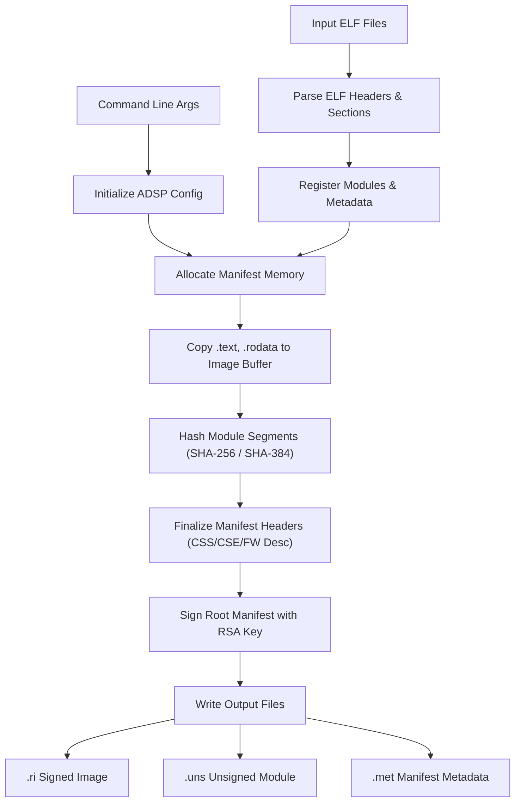
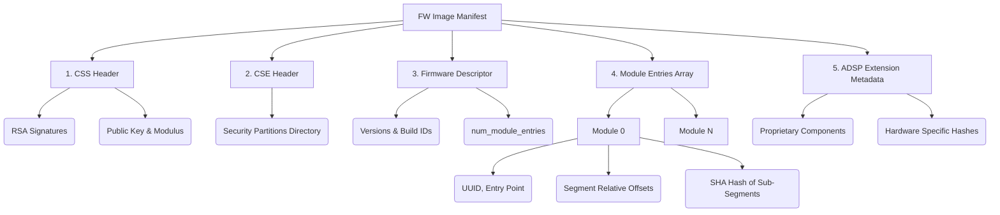

# rimage

`rimage` is a DSP firmware image creation and signing tool targeting the DSP on certain Intel System-on-Chip (SoC). This is used by the [Sound Open Firmware (SOF)](https://github.com/thesofproject/sof) to generate binary image files.

## Building

Most SOF users never build `rimage` directly but as an ExternalProject defined by CMake in SOF. This makes sure they always use an up-to-date version of rimage and configuration files that have been fully tested.

If needed, `rimage` can be built manually with the usual CMake commands:

```shell
$ cmake -B build/
$ make  -C build/ help # lists all targets
$ make  -C build/
```

The `build/rimage` executable can then be copied to a directory in the PATH. Zephyr users can run `west config rimage.path /path/to/rimage/build/rimage`; Zephyr documentation and `west sign -h` have more details.

## Testing tomlc99 changes with SOF Continuous Integration

This section is about leveraging SOF validation to test tomlc99 changes _before_ submitting them to the tomlc99 repository.

Nothing here is actually specific to SOF and tomlc99; you can apply the same test logic to any submodule and parent on GitHub. In fact the same logic applies to submodule alternatives. GitHub is the only requirement.

### Get familiar with git submodules

This is unfortunately not optional for SOF and tomlc99.

For various reasons submodules seem to confuse many git users. Maybe because the versions of the submodules are not directly visible in some configuration file like with most alternatives? Either way, an unfortunate prerequisite before doing any tomlc99 work is to get familiar with git submodules in general. As submodules are built-in there are many resources about them on the Internet. One possible starting point is https://git-scm.com/book/en/v2/Git-Tools-Submodules but feel free to use any other good tutorial instead. Make sure you actually practice a tutorial; don't just read it. Practicing on a temporary and throw-away copy of SOF + tomlc99 is a great idea.

Obviously, you also need to be familiar with regular GitHub pull requests.

### Run SOF tests on unmerged tomlc99 commits

First, push the tomlc99 commits you want to be tested to any branch of your tomlc99 fork on GitHub. Do _not_ submit a tomlc99 pull request yet.

Note your tomlc99 fork must have been created using the actual "fork" button on GitHub so GitHub is aware of the connection with the upstream tomlc99 repo. In the top-left corner you should see `forked from thesofproject/tomlc99` under the name of your fork. If not then search the Internet for "re-attach detached github fork".

Then, **pretend** these tomlc99 commits have already been accepted and merged (they have been neither) and submit to SOF a draft pull request that updates the main SOF branch with your brand new tomlc99 commits to test. The only SOF commit in this SOF TEST pull request is an SOF commit that updates the tomlc99 pointer to the SHA of your last tomlc99 commit. If you're not sure how to do this then you must go back to the previous section and practice submodules more.

Submit this SOF pull request as a GitHub _draft_ so reviewers are _not_ notified. Starting every pull request as a draft is always a good idea but in this case this particular SOF pull request can be especially confusing because it points at commits in a different repo and commits that are not merged yet. So you _really_ don't want to bother busy reviewers (here's a secret: some of the reviewers don't like submodules either). You can freely switch back and forth between draft and ready status and should indeed switch to draft if you forgot at submission time but you can never "un-notify" reviewers.

GitHub has very good support for submodules and will display your SOF TEST pull request better than what the git command line can show. For instance GitHub will list your tomlc99 changes directly in the SOF Pull Request. So if something looks unexpected on GitHub then it means you did something wrong. Stop immediately (except for switching to draft if you forgot) and ask the closest git guru for help.

Search for "Submodule" in the build logs and make sure the last of your new tomlc99 commits has been checked out.

Iterate and force-push your tomlc99 branch and your SOF TEST pull request until all the SOF tests pass. Then you can submit your tomlc99 pull request as usual. In the comments section of the tomlc99 pull request, point at your test results on the SOF side to impress the tomlc99 reviewers and get your tomlc99 changes merged faster.

Finally, after your tomlc99 changes have been merged, you can if you want submit one final SOF pull request that points to the final tomlc99 SHA. Or, if your tomlc99 change is not urgently needed, you can just wait for someone else to do it later. If you do it, copy the tomlc99 git log --oneline in the SOF commit message. Find some good (and less good) commit message examples for submodule updates at https://github.com/thesofproject/sof/commits/main/rimage

## Deep Dive: ELF to Image Conversion and Manifest Structure

`rimage` is responsible for converting standard ELF libraries and executables into DSP-compatible firmware images. It parses input ELF files, extracts loadable sections, calculates cryptographic hashes and signatures, and encapsulates them with platform-specific manifests.

### The Build Process (ELF to Image)



1. **Configuration Initialization**: `rimage` parses its command-line arguments to find the ADSP machine configuration (e.g., Apollolake `apl`, Tigerlake `tgl`, Meteorlake `mtl`). This configuration defines the specific sizes, offsets, and versions the firmware image will require.
2. **Parsing ELF Files**: The `module_open()` and `module_parse_sections()` functions read the ELF headers (`.text`, `.rodata`, `.bss`). These sections are extracted to form the payload of the modules.
3. **Module Registration**: `rimage` reads either the `.module` metadata section directly from the embedded ELF, or a corresponding `TOML` configuration file, which holds instructions on module attributes (e.g., UUID, thread affinity, entry points).
4. **Manifest and Memory Allocation**: Space is pre-allocated for the firmware image. `man_init_image_xxx()` loads the ADSP template manifest into the start of the image buffer. Then, `man_copy_elf_sections()` copies `.text` and `.rodata` sections directly into the buffer, aligning properties sequentially up to `MAN_PAGE_SIZE` (4096 bytes).
5. **Cryptographic Hashing**: Using `hash_sha256()` or `hash_sha384()` (depending on the platform), `rimage` generates a cryptographic digest of each module's `.text` and `.rodata` block. These hash digests are stored in the respective `sof_man_module` entries of the manifest.
6. **Manifest Signing**: Once all modules and internal structures are mapped, the entire structure is finalized with converged security headers (`ri_css_xxx_hdr_create`, `ri_cse_create`). The root manifest signature is then signed (`ri_manifest_sign_...()`) with an RSA private key.
7. **Writing the Payload**: Finally, the newly encapsulated firmware is written to a `.ri` file (`man_write_fw_mod()`). `rimage` also outputs a stripped `.uns` (unsigned module payload) and `.met` (manifest metadata) file for debugging.

### Manifest Structure



The firmware image begins with a structured Manifest. Different platforms use altered sizes and variants (e.g., v1.5, v1.8, v2.5, ace_v1.5), but they typically follow the same overarching hierarchy (note: ordering of CSS and CSE headers may be swapped depending on the manifest version - e.g., v1.8+/v2.5 places CSE first):

1. **CSS Header** (CSS header struct, e.g. `struct css_header_v1_8`, `struct css_header_v2_5`): Cryptographic Signature Structure. Defines the fundamental size, modulus, public key, and RSA signatures used to authenticate the firmware image on the CSME/DSP side.
2. **CSE Header** (CSE partition directory header struct, e.g. `struct CsePartitionDirHeader`, `struct CsePartitionDirHeader_v2_5`): Converged Security Engine Header. A directory mapping security partitions to the ADSP firmware metadata.
3. **Firmware Descriptor** (`struct sof_man_fw_desc` and versioned variants):
   - `header`: Holds the basic firmware versions, build IDs, `preload_page_count`, and the `num_module_entries`.
4. **Module Entries** (`struct sof_man_module`): An array corresponding to each module contained in the image.
   - `struct_id`: Has the literal value `"$AME"`.
   - `name`, `uuid`, `entry_point`, `affinity`.
   - `segment`: Details on the relative position `file_offset` and memory offset `v_base_addr` of `.text`, `.rodata`, and `.bss` partitions.
   - `hash`: SHA-256 or SHA-384 digest of the active segment.
5. **ADSP Extension Metadata** (e.g., `sof_man_adsp_meta_file_ext_v2_5`): Additional proprietary component descriptors attached after the base manifest, frequently hashed recursively for verification integrity.
