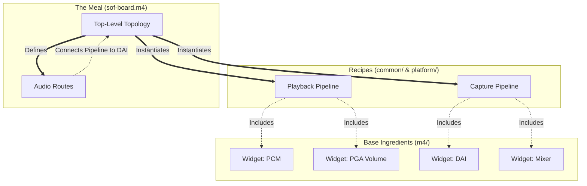
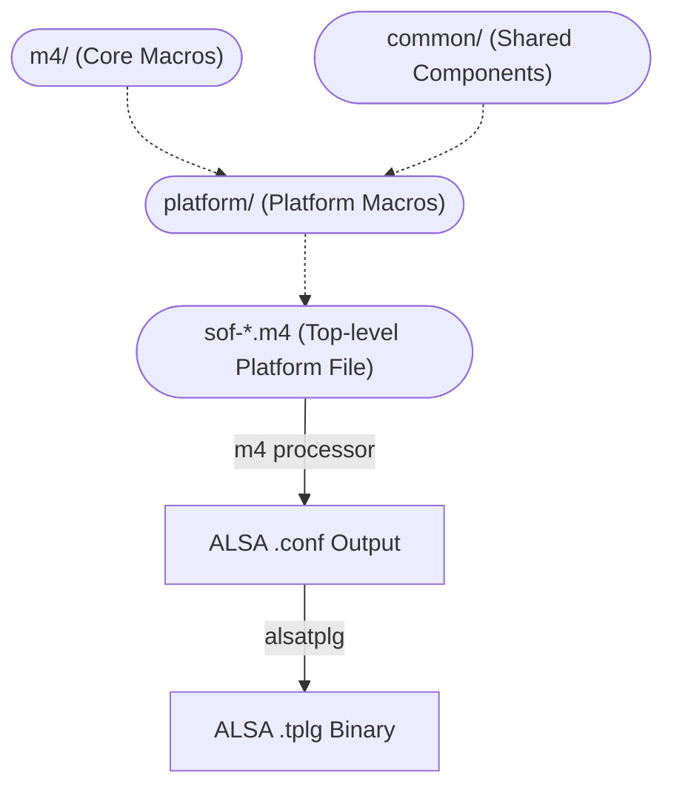

# ALSA Topology v1 (`tools/topology/topology1`)

This directory contains the source files and `m4` macros used to generate version 1 of the ALSA topology binary files (`.tplg`) for Sound Open Firmware.

## Overview

Topology v1 relies heavily on the `m4` macro processor to handle the complexity and reusability of DSP graph definitions. Because raw ALSA configuration files for complex audio routing can become extremely verbose and repetitive, SOF uses `m4` to define logical blocks (like DAIs, SSPs, pipelines, and volume controls) that can be easily instantiated and connected.

## Structure

The core generation components include:

- **`m4/`**: This directory contains the foundational macro definitions. These macros define how base elements like widgets (e.g., `PGA`, `Mixer`, `SRC`), pipelines, and routing paths are constructed in the ALSA `.conf` format.
- **`common/`**: Contains shared components and standard pipeline definitions that are reused across multiple different hardware platforms.
- **`platform/`**: Contains macros and configurations specific to individual hardware architectures (e.g., Intel cAVS, IMX).
- **Platform `.m4` files**: At the root of `topology1`, there are numerous `.m4` files (e.g., `sof-cavs-nocodec.m4`, `sof-imx8-wm8960.m4`). These are the top-level files that instantiate the macros to build a complete topology graph for a specific board or hardware configuration.

## Component Assembly

Building a topology in v1 is essentially a process of calling nested `m4` macros to piece together the DSP pipeline. Here's how the ingredients combine:

1. **Base Macros (`m4/`)**: Define the raw ALSA syntax for things like a single PGA volume control or a DAI link.
2. **Pipelines (`common/`)**: Define a logical sequence of base widgets. For example, a "Playback Pipeline" macro might chain together a Host PCM, a Buffer, a Volume Control (PGA), and an output Buffer.
3. **Top-Level File (`*.m4`)**: Instantiates the pipelines, defines the physical DAI hardware connections, and sets up routing lines between the pipelines and the DAIs.



## Build Flow

### Architecture Diagram



When the SOF build system compiles a v1 topology:

1. The `m4` processor takes a top-level platform `.m4` file.
2. It expands all the macros defined in `m4/`, `common/`, and `platform/`.
3. The output is a raw ALSA `.conf` text file.
4. The `alsatplg` compiler parses this `.conf` file and compiles it into the final `.tplg` binary format loaded by the kernel.

### Build Instructions

Topologies are built automatically as part of the standard SOF CMake build process. To explicitly build all topologies (including v1):

```bash
# From your build directory:
make topologies1
# OR
cmake --build . --target topologies1
```
