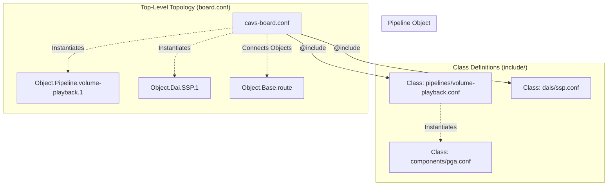
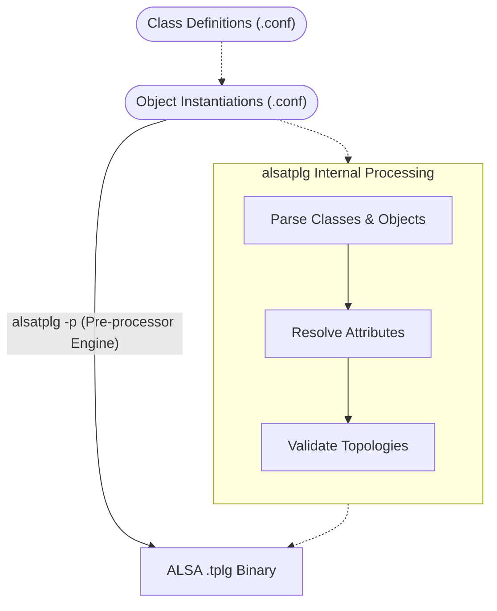

# ALSA Topology v2 (`tools/topology/topology2`)

This directory contains the ALSA Topology v2 source files for Sound Open Firmware.

## Overview

Topology v2 is a modernization of the ALSA topology infrastructure. It aims to solve the verbosity and complexity issues of Topology v1 without relying as heavily on external macro processors like `m4`.

Topology v2 introduces an object-oriented pre-processing layer directly into the newer `alsatplg` compiler (invoked via the `-p` flag). This allows the configuration files to define classes, objects, and attributes natively within the ALSA configuration syntax.

## Key Advantages

- **Object-Oriented Syntax**: Topology v2 allows for the definition of classes (`Class.Widget`, `Class.Pipeline`) and object instantiation, making the topology files much easier to read, maintain, and extend.
- **Reduced Pre-Processing**: By handling templating and instantiation inside the `alsatplg` tool itself, the build process is cleaner and errors are easier to trace back to the source files, as opposed to deciphering expanded `m4` output.
- **Dynamic Variables**: Attributes can be parameterized and passed down to nested objects, allowing for highly flexible definitions of audio pipelines.

## Structure and Component Assembly

Topology v2 shifts the source code layout from macro definitions to class definitions, leveraging the structured nature of the newer compiler.

The directory is built around these core parts:

- **`include/`**: Contains the base ALSA topology class definitions.
  - `components/`: Base classes for individual processing nodes (e.g., PGA, Mixer, SRC).
  - `pipelines/`: Reusable pipeline class definitions that instantiate and connect several base components.
  - `dais/`: Definitions for Digital Audio Interfaces (hardware endpoints).
  - `controls/`: Definitions for volume, enum, and byte controls.
- **`platform/`**: Hardware-specific configurations and overrides (e.g., Intel-specific IPC attributes).
- **Top-Level `.conf` files**: The board-specific configurations (e.g., `cavs-rt5682.conf`). These behave like standard ALSA `.conf` files but utilize the `@include` directive to import classes and instantiate them dynamically.



## Architecture and Build Flow

Unlike v1, Topology v2 processes objects and classes within the `alsatplg` compiler itself.

### Diagram



When building a v2 topology, the `CMakeLists.txt` in `tools/topology/` provides the `add_alsatplg2_command` macro. This macro specifically passes the `-p` flag to `alsatplg`, instructing it to use the new pre-processor engine to resolve the classes and objects defined in the `.conf` files before compiling them into the `.tplg` binary.

### Build Instructions

Topologies are built automatically as part of the standard SOF CMake build process. To explicitly build Topology v2 configurations:

```bash
# From your build directory:
make topologies2
# OR
cmake --build . --target topologies2
```
