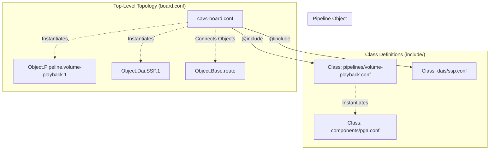

# ALSA Topology v2 (`tools/topology/topology2`)

This directory contains the ALSA Topology v2 source files for Sound Open Firmware.

This readme is a quick intro to the topic. Please refer to full documentation
at https://thesofproject.github.io/latest/developer_guides/topology2/topology2.html

## Overview

Topology v2 is a modernization of the ALSA topology infrastructure. It aims to solve the verbosity and complexity issues of Topology v1 without relying as heavily on external macro processors like `m4`.

Topology v2 introduces an object-oriented pre-processing layer directly into the newer `alsatplg` compiler (invoked via the `-p` flag). This allows the configuration files to define classes, objects, and attributes natively within the ALSA configuration syntax.

Building topologies requires `alsatplg` version 1.2.7 or later. The version check is
enforced in `CMakeLists.txt` at configure time.

## Key Advantages

- **Object-Oriented Syntax**: Topology v2 allows for the definition of classes (`Class.Widget`, `Class.Pipeline`) and object instantiation, making the topology files much easier to read, maintain, and extend.
- **Reduced Pre-Processing**: By handling templating and instantiation inside the `alsatplg` tool itself, the build process is cleaner and errors are easier to trace back to the source files, as opposed to deciphering expanded `m4` output.
- **Dynamic Variables**: Attributes can be parameterized and passed down to nested objects, allowing for highly flexible definitions of audio pipelines.

Topology2 uses a class-based object model built on four core concepts:

* **Classes** (`Class.Pipeline`, `Class.Widget`, `Class.PCM`) define reusable templates
  with default attribute values
* **Objects** (`Object.Pipeline`, `Object.Widget`, `Object.PCM`) instantiate classes with
  specific parameter values
* **Define blocks** provide variable substitution using `$VARIABLE` syntax, enabling
  parameterized topologies
* **IncludeByKey** enables conditional includes based on variable values, used primarily
  for platform-specific overrides

## Structure and Component Assembly

Topology v2 shifts the source code layout from macro definitions to class definitions, leveraging the structured nature of the newer compiler.

The directory is built around these core parts:

- **`include/`**: Contains the base ALSA topology class definitions.
  - `components/`: Base classes for individual processing nodes (e.g., PGA, Mixer, SRC).
  - `pipelines/`: Reusable pipeline class definitions that instantiate and connect several base components.
  - `dais/`: Definitions for Digital Audio Interfaces (hardware endpoints).
  - `controls/`: Definitions for volume, enum, and byte controls.
- **`platform/`**: Hardware-specific configurations and overrides (e.g., Intel-specific IPC attributes).
- **Top-Level `.conf` files**: The board-specific configurations (e.g., `cavs-rt5682.conf`). These behave like standard ALSA `.conf` files but utilize the `@include` directive to import classes and instantiate them dynamically.

### Detailed Directory Layout

```text
tools/topology/topology2/
├── CMakeLists.txt                     # Build system entry point
├── get_abi.sh                         # ABI version extraction script
├── cavs-sdw.conf                      # SoundWire topology entry point
├── sof-hda-generic.conf               # HDA generic topology entry point
├── cavs-mixin-mixout-hda.conf         # HDA with mixer pipelines
├── cavs-nocodec.conf                  # SSP nocodec topology
├── ...                                # Other top-level .conf entry points
├── include/
│   ├── common/                        # Core class definitions (PCM, route, audio formats)
│   ├── components/                    # Widget/component classes (gain, mixin, EQ, DRC)
│   ├── controls/                      # Control classes (mixer, enum, bytes)
│   ├── dais/                          # DAI classes (SSP, DMIC, HDA, ALH)
│   └── pipelines/                     # Pipeline template classes
│       └── cavs/                      # CAVS-architecture pipeline classes
├── platform/
│   └── intel/                         # Platform-specific overrides (tgl, mtl, lnl, ptl)
├── production/                        # CMake targets for production topologies
│   ├── tplg-targets-ace1.cmake        # Intel ACE1 (MTL) targets
│   ├── tplg-targets-ace2.cmake        # Intel ACE2 (LNL) targets
│   ├── tplg-targets-ace3.cmake        # Intel ACE3 (PTL) targets
│   └── ...                            # Additional platform target files
├── development/                       # CMake targets for development/testing
└── doc/                               # Doxygen documentation source
```



## Architecture and Build Flow

Unlike v1, Topology v2 processes objects and classes within the `alsatplg` compiler itself.

### Diagram


When building a v2 topology, the `CMakeLists.txt` in `tools/topology/` provides the `add_alsatplg2_command` macro. This macro specifically passes the `-p` flag to `alsatplg`, instructing it to use the new pre-processor engine to resolve the classes and objects defined in the `.conf` files before compiling them into the `.tplg` binary.

### Build Instructions

Topologies are built automatically as part of the standard SOF CMake build process. To explicitly build Topology v2 configurations:

```bash
# From your build directory:
make topologies2
# OR
cmake --build . --target topologies2
```

To build a specific topology target:

```bash
make sof-lnl-sdw-cs42l43-l0-cs35l56-l12
```

## Best Practices for Adding New Topology Definitions

### Topology Structure

A top-level topology `.conf` file follows a layered configuration pattern:

```conf
# 1. Search directories
<searchdir:include>
<searchdir:include/common>
<searchdir:include/components>
<searchdir:include/dais>
<searchdir:include/pipelines/cavs>
<searchdir:platform/intel>

# 2. Include class files
<vendor-token.conf>
<tokens.conf>
<pcm.conf>
<host-copier-gain-mixin-playback.conf>
<mixout-gain-alh-dai-copier-playback.conf>

# 3. Define block (default variable values)
Define {
    PLATFORM        ""
    NUM_HDMIS       3
    DEEP_BUFFER_PCM_ID  31
}

# 4. Platform overrides (conditional includes)
IncludeByKey.PLATFORM {
    "mtl"   "platform/intel/mtl.conf"
    "lnl"   "platform/intel/lnl.conf"
    "ptl"   "platform/intel/ptl.conf"
}

# 5. Conditional feature includes
IncludeByKey.NUM_HDMIS {
    "3"     "platform/intel/hdmi-generic.conf"
}

# 6. DAI, Pipeline, PCM objects
# 7. Route definitions
```

### Reusing Existing Bases

The most common way to add a new topology is to reuse an existing base `.conf` file and
override variables through a cmake target entry. Targets are defined in
`production/tplg-targets-*.cmake` files using a tuple format:

```text
"input-conf;output-name;variables"
```

For example, to add a new SoundWire topology variant for ACE2 (Lunar Lake):

```text
"cavs-sdw\;sof-lnl-sdw-cs42l43-l0-cs35l56-l12\;PLATFORM=lnl,NUM_SDW_AMP_LINKS=2"
```

The first element is the base `.conf` file (without extension), the second is the output
`.tplg` filename, and the third is a comma-separated list of variable overrides.

### Creating a New Base Topology

When existing bases do not cover a new use case, create a new top-level `.conf` file:

1. Create a new `.conf` file in `tools/topology/topology2/` following the layered
   structure described above
2. Include the required class files from `include/` directories via search directives
3. Define default variables in a `Define` block
4. Add `IncludeByKey.PLATFORM` entries for platform-specific overrides
5. Instantiate DAI, Pipeline, and PCM objects with appropriate IDs
6. Define routes connecting FE mixin outputs to BE mixout inputs
7. Register the topology as a cmake target in the appropriate
   `production/tplg-targets-*.cmake` file

### PCM ID Conventions

PCM IDs identify audio streams exposed to userspace via ALSA. Each PCM ID must be unique
within a single topology. Different topology families (Intel SoundWire vs HDA) use different
default ID ranges for the same endpoint types.

**Intel SoundWire PCM IDs:**

| Endpoint | Default PCM ID | Override Variable |
|---|---|---|
| Jack (playback/capture) | 0 | — |
| Speaker amplifier | 2 | — |
| SDW DMIC | 4 | — |
| HDMI 1 | 5 | `HDMI1_PCM_ID` |
| HDMI 2 | 6 | `HDMI2_PCM_ID` |
| HDMI 3 | 7 | `HDMI3_PCM_ID` |
| PCH DMIC0 | 10 | `DMIC0_PCM_ID` |
| PCH DMIC1 | 11 | `DMIC1_PCM_ID` |
| Jack Echo Ref | 11 | `SDW_JACK_ECHO_REF_PCM_ID` |
| Speaker Echo Ref | 12 | `SDW_SPK_ECHO_REF_PCM_ID` |
| Bluetooth | 2 or 20 | `BT_PCM_ID` |
| Deep Buffer (Jack) | 31 | `DEEP_BUFFER_PCM_ID` |
| Deep Buffer (Speaker) | 35 | `DEEP_BUFFER_PCM_ID_2` |
| DMIC Deep Buffer | 46 | `DMIC0_DEEP_BUFFER_PCM_ID` |
| Compress Jack Out | 50 | `COMPR_PCM_ID` |
| Compress Speaker | 52 | `COMPR_2_PCM_ID` |

> **Note:** Bluetooth defaults to PCM ID 2 in some topologies and 20 in others. Use the
> `BT_PCM_ID` override variable to set the correct value when BT coexists with a speaker
> amplifier (which also uses PCM ID 2 by default).

**Intel HDA PCM IDs:**

| Endpoint | Default PCM ID | Override Variable |
|---|---|---|
| HDA Analog | 0 | — |
| HDMI 1 | 3 | `HDMI1_PCM_ID` |
| HDMI 2 | 4 | `HDMI2_PCM_ID` |
| HDMI 3 | 5 | `HDMI3_PCM_ID` |
| DMIC0 | 6 | `DMIC0_PCM_ID` |
| Deep Buffer | 31 | `DEEP_BUFFER_PCM_ID` |
| Compress HDA Analog | 50 | `COMPR_PCM_ID` |

Key rules:

* PCM ID 0 is always the primary playback endpoint
* PCM IDs must be unique within a single topology
* When features coexist (SDW + PCH DMIC + HDMI), adjust IDs via `Define` overrides in
  cmake targets to avoid conflicts
* Different topology families (SDW vs HDA) use different default ID ranges for the same
  endpoint types

### Pipeline ID Conventions

Pipeline IDs are set via the `index` attribute on pipeline objects. Front-end (FE) and
back-end (BE) pipelines are paired, with the FE pipeline at index N and the BE pipeline
at index N+1.

In SoundWire topologies, pipeline indexes follow the convention documented in
`sdw-amp-generic.conf` and `sdw-dmic-generic.conf`: pipeline index = PCM ID × 10. HDMI
pipelines use a stride-10 pattern where the host pipeline is at N0 and the DAI pipeline
is at N1 (50/51, 60/61, 70/71, 80/81).

**Intel SoundWire Pipeline IDs:**

| Pipeline | Default Index | Override Variable |
|---|---|---|
| Jack Playback FE / BE | 0 / 1 | — |
| Jack Capture FE / BE | 10 / 11 | — |
| Deep Buffer (Jack) | 15 | `DEEP_BUFFER_PIPELINE_ID` |
| Deep Buffer (Speaker) | 16 | `DEEP_BUFFER_PIPELINE_ID_2` |
| Speaker FE / BE | 20 / 21 | — |
| Speaker Echo Ref FE / BE | 22 / 23 | — |
| SDW DMIC FE / BE | 40 / 41 | `SDW_DMIC_HOST_PIPELINE_ID` |
| HDMI 1 Host / DAI | 50 / 51 | `HDMI1_HOST_PIPELINE_ID` / `HDMI1_DAI_PIPELINE_ID` |
| HDMI 2 Host / DAI | 60 / 61 | `HDMI2_HOST_PIPELINE_ID` / `HDMI2_DAI_PIPELINE_ID` |
| HDMI 3 Host / DAI | 70 / 71 | `HDMI3_HOST_PIPELINE_ID` / `HDMI3_DAI_PIPELINE_ID` |
| HDMI 4 Host / DAI | 80 / 81 | `HDMI4_HOST_PIPELINE_ID` / `HDMI4_DAI_PIPELINE_ID` |
| Compress Jack / Speaker | 90 / 92 | `COMPR_PIPELINE_ID` / `COMPR_2_PIPELINE_ID` |
| PCH DMIC0 Host / DAI | 100 / 101 | `DMIC0_HOST_PIPELINE_ID` / `DMIC0_DAI_PIPELINE_ID` |

**Intel HDA Pipeline IDs:**

| Pipeline | Default Index | Override Variable |
|---|---|---|
| Analog Playback FE / BE | 1 / 2 | — |
| Analog Capture FE / BE | 3 / 4 | — |
| DMIC0 Host / DAI | 11 / 12 | `DMIC0_HOST_PIPELINE_ID` / `DMIC0_DAI_PIPELINE_ID` |
| Deep Buffer | 15 | `DEEP_BUFFER_PIPELINE_ID` |
| HDMI 1 Host / DAI | 50 / 51 | `HDMI1_HOST_PIPELINE_ID` / `HDMI1_DAI_PIPELINE_ID` |
| HDMI 2 Host / DAI | 60 / 61 | `HDMI2_HOST_PIPELINE_ID` / `HDMI2_DAI_PIPELINE_ID` |
| HDMI 3 Host / DAI | 70 / 71 | `HDMI3_HOST_PIPELINE_ID` / `HDMI3_DAI_PIPELINE_ID` |
| HDMI 4 Host / DAI | 80 / 81 | `HDMI4_HOST_PIPELINE_ID` / `HDMI4_DAI_PIPELINE_ID` |
| Compress HDA Analog Host / DAI | 90 / 91 | `COMPR_PIPELINE_ID` |

Key rules:

* FE and BE pipelines are paired: FE = N, BE = N+1
* SDW convention: pipeline index = PCM ID × 10 (documented in `sdw-amp-generic.conf` and
  `sdw-dmic-generic.conf`)
* HDMI uses stride-10: Host = N0, DAI = N1
* Pipeline IDs must be unique within a single topology
* When adding new endpoints, select IDs in unused ranges that do not conflict with
  existing assignments

### Widget Naming

Widget names follow the convention `<type>.<pipeline-index>.<instance>`. Examples:

* `gain.1.1` — gain widget in pipeline 1, instance 1
* `mixin.15.1` — mixin widget in pipeline 15, instance 1
* `host-copier.0.playback` — host copier in pipeline 0, playback direction
* `dai-copier.1.ALH` — DAI copier in pipeline 1, ALH type

### Route Definitions

Routes connect FE pipeline mixin outputs to BE pipeline mixout inputs. This is the
primary mechanism for linking front-end and back-end pipelines:

```conf
Object.Base.route [
    {
        source  "mixin.15.1"
        sink    "mixout.2.1"
    }
]
```

Multiple FE pipelines can feed into a single BE mixout. For example, both a normal
playback pipeline and a deep buffer pipeline can route to the same DAI output:

```text
host-copier.0 -> gain.0 -> mixin.0 ─┐
                                     ├─> mixout.1 -> gain.1 -> dai-copier.1 -> DAI
host-copier.15 -> gain.15 -> mixin.15┘
```

### Platform Overrides

Platform-specific configurations are applied using the `IncludeByKey.PLATFORM` mechanism.
Each platform `.conf` file under `platform/intel/` contains `Define` blocks that override
variables such as `DMIC_DRIVER_VERSION`, `SSP_BLOB_VERSION`, and `NUM_HDMIS`.

Supported platforms:

* `tgl` — Intel Tiger Lake / Alder Lake (CAVS 2.5)
* `mtl` — Intel Meteor Lake (ACE 1.x)
* `lnl` — Intel Lunar Lake (ACE 2.x)
* `ptl` — Intel Panther Lake (ACE 3.x)

```conf
IncludeByKey.PLATFORM {
    "mtl"   "platform/intel/mtl.conf"
    "lnl"   "platform/intel/lnl.conf"
    "ptl"   "platform/intel/ptl.conf"
}
```

### Registering CMake Targets

Production topologies are registered in `production/tplg-targets-*.cmake` files. Each
target is a semicolon-separated tuple:

```text
"input-conf;output-name;variable1=value1,variable2=value2"
```

Select the cmake file matching the target platform generation:

| Platform | CMake Target File |
|---|---|
| Tiger Lake / Alder Lake | `tplg-targets-cavs25.cmake` |
| Meteor Lake | `tplg-targets-ace1.cmake` |
| Lunar Lake | `tplg-targets-ace2.cmake` |
| Panther Lake | `tplg-targets-ace3.cmake` |
| HDA generic | `tplg-targets-hda-generic.cmake` |

Development and testing topologies go in `development/tplg-targets.cmake`.
